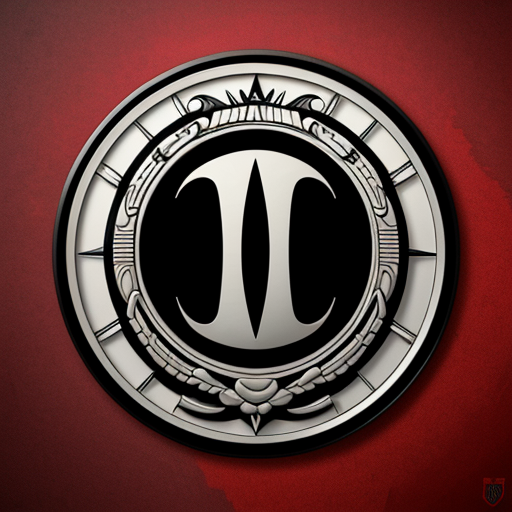

  

###

  

###

  

###

<h1 align="center">ALOO ! 🙋‍♂️</h1>

###

<h3 align="left">👩‍💻  About Me</h3>

###

I'm Andreas from Jakarta  - 🔭 I’m a Computer Science Student - 📚 I'm currently learning Machine Learning & very deep Deep Learning - ⚡ In my free time I spent my free time

###

<h3 align="left">🛠 Language and tools</h3>

###

  
  
  
  
  
  
  
  
  
  
  
  
  
  
  

###

  
  
  
  
  
  
  
  
  
  
  

###

  
  
  
  
  
  
  

###

<h3 align="left">🔥   My Stats :</h3>

###

  

###

  

###
